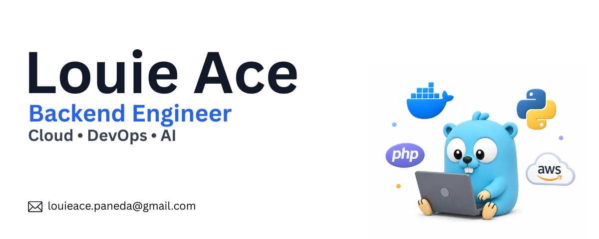
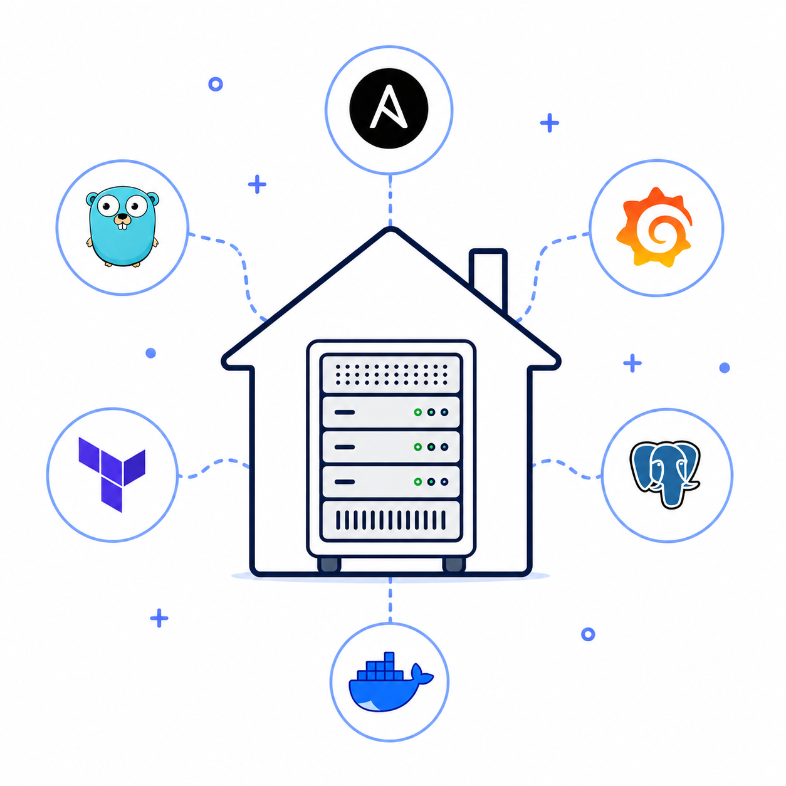
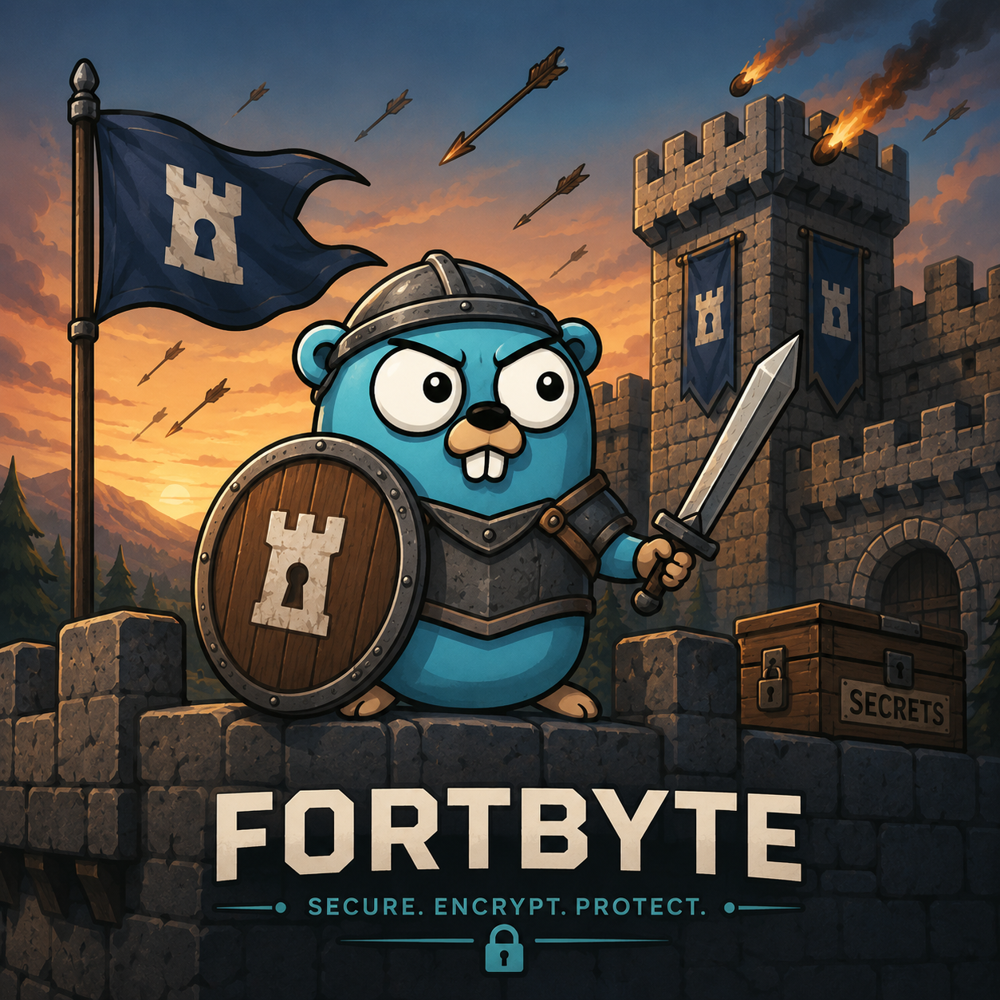
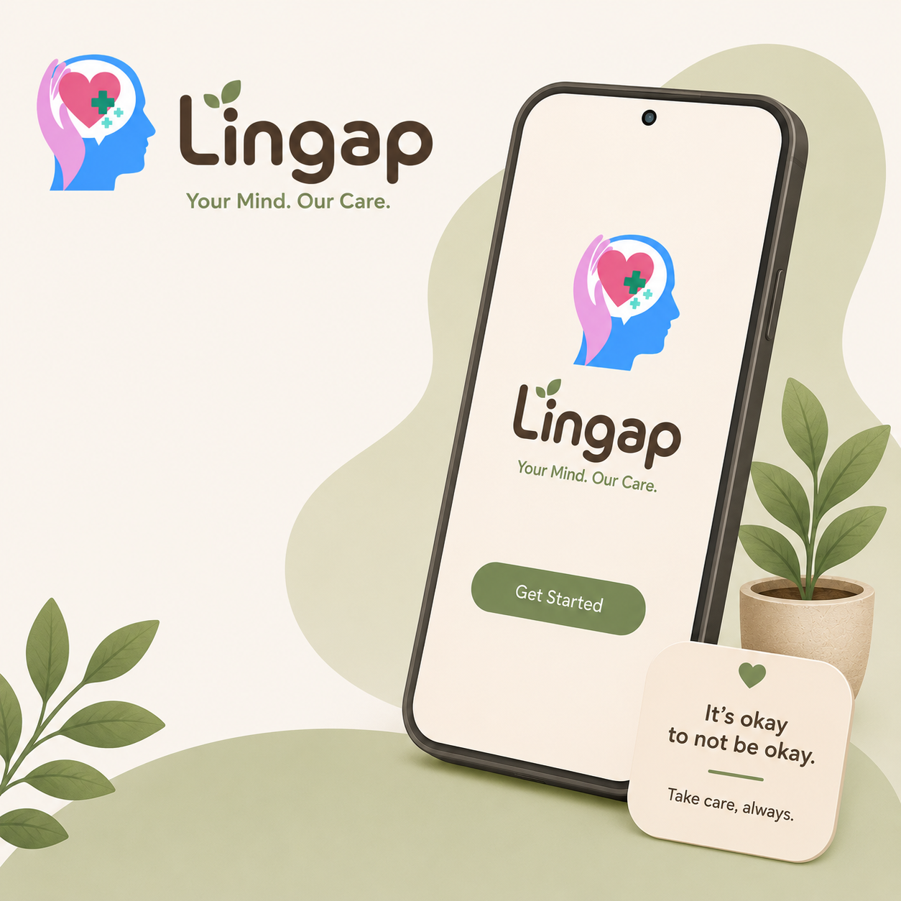

	

## About Me

I'm a Software Engineer with professional experience in backend development, cloud infrastructure, and CI/CD automation. I enjoy building reliable systems-from designing APIs and deployment pipelines to operating production workloads Alongside my professional work, I build AI applications using Go, Python, Flutter, computer vision, and Retrieval-Augmented Generation (RAG).

---

## Featured Work

<table>
	<tr>
		<td width="25%" align="center">
			
		</td>
		<td width="25%" align="center">
			
		</td>
		<td width="25%" align="center">
			
		</td>
		<td width="25%" align="center">
			
		</td>
	</tr>
	<tr>
		<td align="center" valign="top">
			<strong>Self-Hosted Homelab</strong>
			 
			Self-hosted infrastructure for deployment automation, monitoring, reverse proxy, and container orchestration.
			  
			<em>Always evolving</em>
		</td>
		<td align="center" valign="top">
			<strong>FortByte</strong>
			 
			Secrets manager built with Go, PostgreSQL, Docker, JWT authentication, and REST APIs.
			  
			<em>In Progress</em>
		</td>
		<td align="center" valign="top">
			<strong>Lingap</strong>
			 
			Flutter application featuring an AI mental health assistant powered by a RAG pipeline using Pinecone and LLM APIs.
		</td>
		<td align="center" valign="top">
			<strong>Cornstalk</strong>
			 
			Flutter computer vision application using a custom-trained YOLO model built from a Kaggle dataset with Roboflow.
		</td>
	</tr>
</table>

---

## Tech Stack

### Languages & Databases

### DevOps & Cloud

### AI & Machine Learning

---

## Current Focus

- Building **FortByte**, an open-source secrets manager in Go
- Expanding my self-hosted cloud infrastructure and automation stack
- Learning Kubernetes and modern cloud-native technologies

---

## Let's Connect

